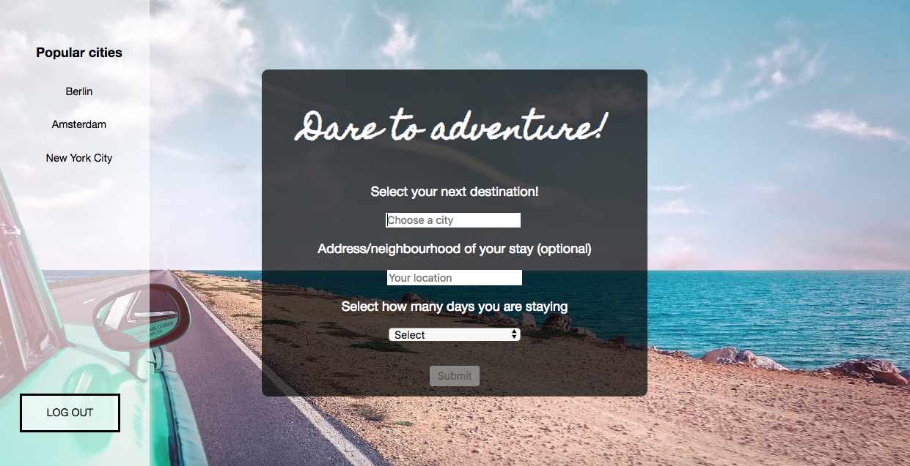
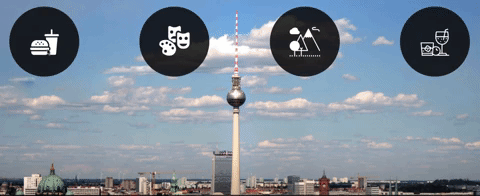
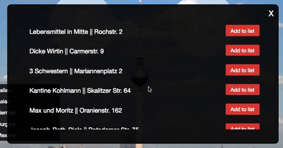
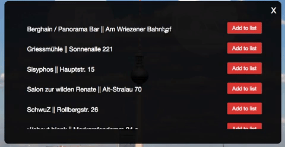
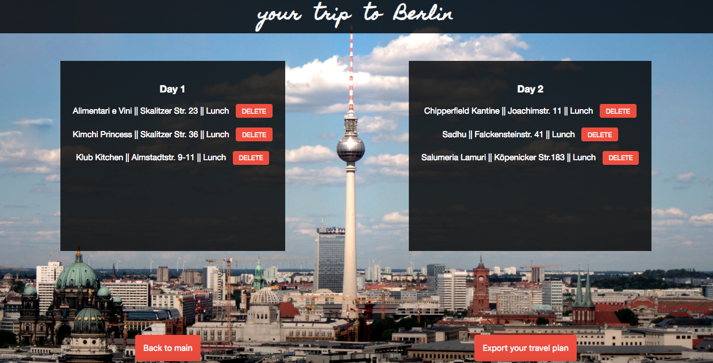

# Dare to adventure: a travel website to make your trips easier

Website
--------
Coming soon.

Tech stack
-------- 
- React/Redux
- Node.js
- Express.js
- PostgreSQL
- Foursquare, Pexels and Apixu Weather APIs
- HTML5/CSS3

Overview
--------
#### Short description 
For the final project at SPICED Academy I have built a single-page travel website which allows users to explore a city of their choice and to create a personal itinerary for the next city trip adjusted to their needs and preferences. 

#### Walkthrough
Upon arrival on the website the user can register or log in. 

  

In case the user has just registered and hasn't previously created any travel plans on the website they are shown a setup page where they can choose a city of their liking using an incremental search, select how many days they are staying, optionally add the city district or the exact address they are staying at and take a look at the top 3 popular cities most chosen by other users. The submit button is greyed out until both city and the amount of days are selected.

  

After selecting city and the amount of days for the trip the user is shown their "working area" where they can explore four categories (food, culture, nature & outdoors and nightlife) for the selected city. Moreover they are shown weather for the selected location. The background image is dynamically adjusted for the selected city (Pexels API). Weather information is coming from Apixu Weather API. The user also has a possibility to edit/add their exact address/location.

  

If the user has provided their address/location, they can select the search radius relative to it (<1km, <5km, <10km) when choosing a category. If no location/address was provided or when user just did not select a radius a default radius of 15km is used.

Moreover, the user is presented with a more detailed choice when selecting a category (e.g. breakfast, lunch, dinner or coffee when selecting the food category). Additionally, the "dinner" subcategory presents the user with the choice of cuisine.

  

Results for each category are shown in bulks of 10. They come from Foursquare API. A "more" button is provided allowing the user to browsing the category as long as they like.

  

When exploring activities from different categories user can click on a venue to get more detailed information (including description, price range and other users' reviews) about it.

  

Furthermore, user has ability to add/delete activities to/from their itinerary.

  

The adding limit for one day is 5 activities. If user already added 5 activities to one of the days it becomes impossible to add anything to that day. When all days are "full" the ability to add activities vanishes and the user is notified about this bottleneck. Moreover, it is not possible to add an activity to the same day twice -- an error message is shown in this case.

At any time user can look at their travel plan. There is also a possibility to export the plan as a PDF-file.

  

If an existing user logs in their working area will be loaded (including city, amount of days and already selected activities).

Future Features
--------
-  Make it responsive 📱 
- Add event integration from eventbrite API (find events for that city for specific dates) 📅
- Adjust add/delete buttons to Foursquare category results on load (so that the user sees right away which venues have already been added if they open the category again)
- DRY the code
- Add loading screen while waiting for API results
- Fix PDF export 📖

